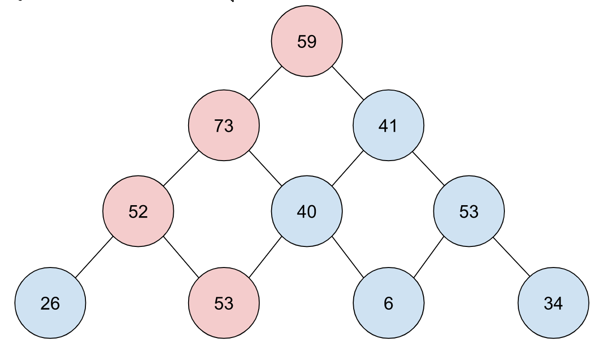

# Assignment

## 1. จงหาเส้นทางที่มีค่ามากที่สุด



- ซึ่งจะอยู่ใน Array ดังต่อไปนี้ `[[59], [73, 41], [52, 40, 53], [26, 53, 6, 34]]`
- โดยเส้นทางที่มีค่ามากที่สุดจะเป็นตามจุดสีแดง
- แต่ละ node ห้ามย้อนกลับ (ต้องขึ้นลงเป็นทางเดียว) และเชื่อมกัน
- คำตอบให้อยู่ในรูปของ จำนวนรวมของเส้นทางที่ผ่าน ซึ่งจากตัวอย่างคือ `237`

ให้เขียนโปรแกรมภาษา Typescript โดยใช้ input จากไฟล์นี้ <https://github.com/7-solutions/backend-challenge/blob/main/files/hard.json> และแสดงผลเป็นค่าที่ได้จากการคำนวณ

input = `[[59], [73, 41], [52, 40, 53], [26, 53, 6, 34]]`
output = `237`


## 2. จับฉันให้ได้สิ ซ้าย-ขวา-เท่ากับ

ให้ถอดรหัสตัวอักษรตามตัวอย่างด้านล่าง

```
สัญลักษณ์ “L” หมายความว่า ตัวเลขด้านซ้าย มีค่ามากกว่า ตัวเลขด้านขวา
สัญลักษณ์ “R” หมายความว่า ตัวเลขด้านขวา มีค่ามากกว่า ตัวเลขด้านซ้าย
สัญลักษณ์ “=“ หมายความว่า ตัวเลขด้านซ้าย มีค่าเท่ากับ ตัวเลขด้านขวา

ตัวอย่างเช่น ตัวเลขชุด “410233“ จะเข้ารหัสได้เป็น “LLRR=“

อธิบายเพิ่มเติม จากตัวเลขชุด “410233“

เลขคู่แรกคือ 4 และ 1      => ตัวเลขซ้าย (4) มากกว่า ตัวเลขขวา (1)   => “L“
เลขคู่ถัดมาคือ 1 และ 0   => ตัวเลขซ้าย (1) มากกว่า ตัวเลขขวา (0)   => “L“
เลขคู่ถัดมาคือ 0 และ 2   => ตัวเลขซ้าย (0) น้อยกว่า ตัวเลขขวา (2)  => “R“
เลขคู่ถัดมาคือ 2 และ 3   => ตัวเลขซ้าย (2) น้อยกว่า ตัวเลขขวา (3)  => “R“
เลขคู่ถัดมาคือ 3 และ 3   => ตัวเลขซ้าย (3) เท่ากับ ตัวเลขขวา (3)  => “=“

“LLRR=” สามารถแปลงได้เป็น “410233” หรือ “210122“ ก็ได้ 
ผลรวมตัวเลขทุกตัวของ 410233 = 4 + 1 + 0 + 2+. 3 + 3 = 13
ผลรวมตัวเลขทุกตัวของ 210122 = 2 + 1 + 0 + 1 + 2 + 2  = 8
คำตอบคือ เลขชุด 210122 เนื่องจาก ผลรวมของทุกตัวเลขมีค่าน้อยที่สุด
```

ให้เขียนโปรแกรม ภาษา Typescript เพื่อรับข้อมูลข้อความที่เข้ารหัสแล้ว จาก keyboard (encoded) และให้แปลงกับเป็นตัวเลขชุด ที่มีผลรวมของทุกตัวเลข มีค่าน้อยที่สุดแสดงผลเป็น ตัวเลขชุด ชุดนั้น

input = `LLRR=`
output = `210122`


## 3. พาย ไฟ ได - Pie Fire Dire  

โจทย์คือ ให้รายชื่อของเนื้อหลายชนิด ปะปนกันเช่น

```Fatback t-bone t-bone, pastrami  ..   t-bone.  pork, meatloaf jowl enim.  Bresaola t-bone.```

`ทุกคำเป็นชื่อชนิดเนื้อทั้งหมด` โดยที่ไม่ต้องสนใจ , . หรือ space

จงหารายชื่อเนื้อทั้งหมด และระบุจำนวนของเนื้อแต่ละชนิด

ใช้ข้อความจาก <https://baconipsum.com/api/?type=meat-and-filler&paras=99&format=text>

- Your project must use Typescript, Typescript module, and HTTP framework (GRPC is plus)
- You create a JSON API at this endpoint /beef/summary
- The JSON API must count the number of beef
- We encourage you to write tests, which we will give you some extra score
- We will give you an extra score if you focus on performance.

--- sample response --

```json
{
    "beef": {
        "t-bone": 4,
        "fatback": 1,
        "pastrami": 1,
        "pork": 1,
        "meatloaf": 1,
        "jowl": 1,
        "enim": 1,
        "bresaola": 1
    }
}
```


## 4. สร้างข้อมูลจาก API 

ใช้ข้อความจาก <https://dummyjson.com/users>

- Your project must use Typescript, Typescript module, and HTTP framework (GRPC is plus)
- tranforms JSON data from API to new data groupBy department
- We encourage you to write tests, which we will give you some extra score
- We will give you an extra score if you focus on performance.

--- sample response --

```json

department: [
    {
        "Marketing": {
            "male": 1,                      // ---> Male Summary
            "female": 1,                    // ---> Femlae Summary
            "ageRange": "XX-XX",            // ---> Range
            "ageMode": 1,                   // ---> Mode
            "hair": {                       // ---> "Color": Color Summary
                "Black": 1,                
                "Blond": 1,
                "Chestnut": 1,
                "Brown": 1
            },
            "addressUser": {                // ---> "firstNamelastName": postalCode (address)
                "TerryMedhurst": "XXXXX",
            }
        }
    }, 
    ...
]
```
